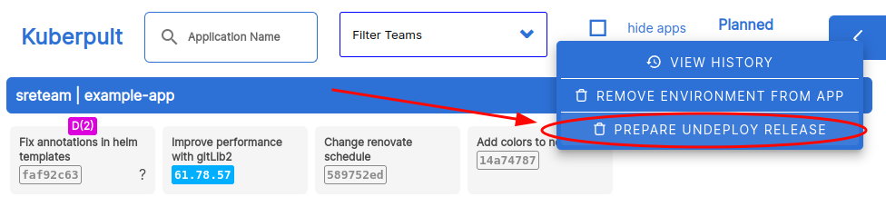
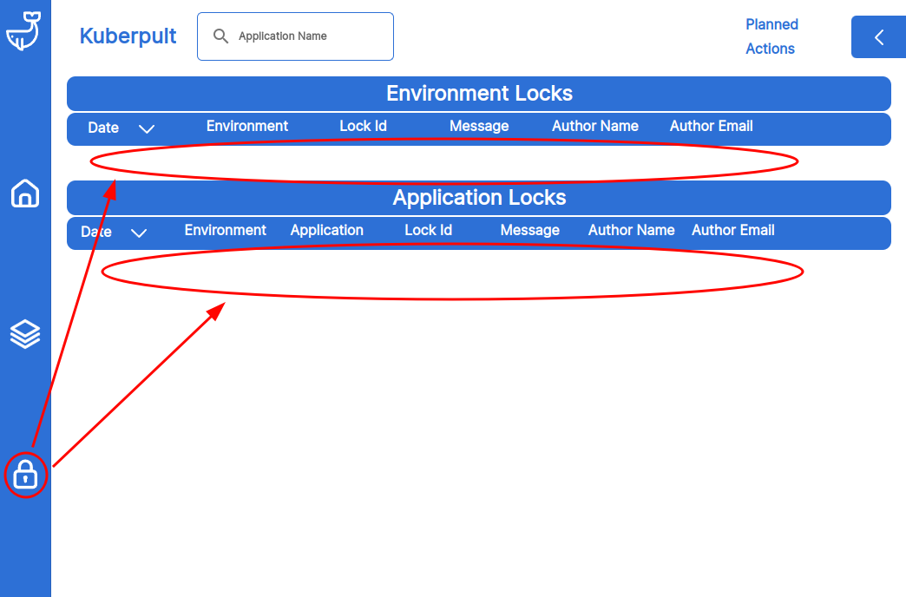
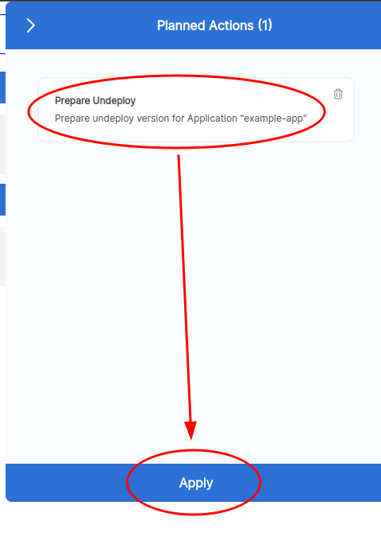
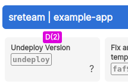
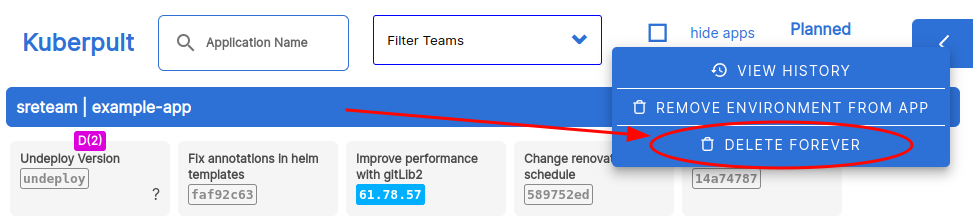
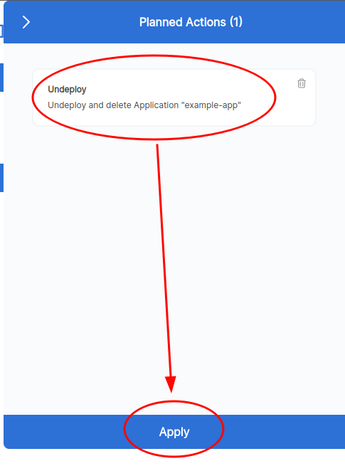

# Kuberpult Readme for users

## Etymology

Kuberpult is a catapult for [kubernetes](https://kubernetes.io/) :) it catapults the containers of microservices to different stages in kubernetes clusters.

## About

**Kuberpult** helps you manage different versions of different microservices in different cluster.
While [Argo CD](https://argo-cd.readthedocs.io/en/stable) applies the *current* version of your services in clusters,
Kuberpult also helps you with managing what is deployed *next*.

## Purpose
The purpose of Kuberpult is to help roll out quickly yet organized.
We use it for requirements like this:
* We have 3 clusters, development, staging, production
* Any merged changes should instantly be deployed to development.
* After running some test on development, roll out to staging.
* Once a day we trigger a release train that deploys everything to production - using the versions of staging as source.
* Sometimes we want to prevent certain deployments, either of single services, or of entire clusters.
* We never want to deploy (to production) between 9am and 11am as these are peak business hours.


## Kuberpult Design Principles

We use these principles to decide what features to focus on. We may deviate a little, but in general
we don't want features in kuberpult that violate these points:

* **Automatic and regular deployments**: Kuberpult is built for teams who want to deploy often (e.g. daily) and setup automated processes for the deployments.
* **All power to the engineers**: Kuberpult never stops an engineer from deploying manually. The engineers know their services best, so they can decide which version to deploy.
* **Microservices**: Kuberpult is built on the assumption that our teams work with kubernetes microservices.
* **Monorepo**: Kuberpult is built for a monorepo setup. One product should be one monorepo. If you have multiple products, consider giving each one a kuberpult instance.


## API
Kuberpult has an API that is intended to be used in CI/CD (GitHub Actions, Azure Pipelines, etc.) to release new versions of one (or more) microservices.
The API can also roll out many services at the same time via "release trains". It also supports rolling out some groups of services.

# Argo CD
Kuberpult works best with [Argo CD](https://argo-cd.readthedocs.io/en/stable/) which applies the
manifests to your clusters and Kuberpult helps you to manage those manifests in the repository.

`Kuberpult` does not actually `deploy`. That part is usually handled by Argo CD.

# App Locks & Environment Locks
`Kuberpult` can handle *locks* in its UI. When something is locked, it's version will not be changed via the API.
Both *environments* and *microservices* can be `locked`.

## Public releases of Kuberpult

### Docker Registries
Kuberpult's docker images are currently available in 2 docker registries: (Example with version 0.4.55)
* `docker pull europe-west3-docker.pkg.dev/fdc-public-docker-registry/kuberpult/kuberpult-frontend-service:0.4.55` ([Link for Kuberpult devs](https://console.cloud.google.com/artifacts/docker/fdc-public-docker-registry/europe-west3/kuberpult/kuberpult-frontend-service))
* `docker pull ghcr.io/freiheit-com/kuberpult/kuberpult-frontend-service:0.4.55` ([Link for Kuberpult devs](https://github.com/freiheit-com/kuberpult/pkgs/container/kuberpult%2Fkuberpult-frontend-service))
And the same applies for the `kuberpult-cd-service` - just replace "frontend" by "cd".

We may deprecate one of the registries in the future for simplicity.

If you're using Kuberpult's helm chart, generally you don't have to worry about that.

### GitHub Releases

To use the helm chart, you can use [this url](https://github.com/freiheit-com/kuberpult/releases/download/0.4.55/kuberpult-0.4.55.tgz) (replace both versions with the current version!).
You can see all releases on the [Releases page on GitHub](https://github.com/freiheit-com/kuberpult/releases)

#### Helm Chart 
See [values.yaml.tpl](https://github.com/freiheit-com/kuberpult/blob/main/charts/kuberpult/values.yaml.tpl) for details like default values.

Most important helm chart parameters are:
* `git.url`: **required** - The url of the git manifest repository. This is a shared repo between Kuberpult and Argo CD.
* `git.branch`: **recommended** - Branch name of the git repo. Must be the same one that Argo CD uses.
* `ssh.identity`: **required** - The ssh private key to access the git manifest repo.
* `ssh.known_hosts`: - The ssh key fingerprints of for your git provider (e.g. [GitHub](https://docs.github.com/en/authentication/keeping-your-account-and-data-secure/githubs-ssh-key-fingerprints))
* `pgp.keyring`: **recommended** - Additional security. Highly recommended if you do not us IAP. If enabled, calls to the REST API need to provide signatures with each call. See [create-release](https://github.com/freiheit-com/kuberpult/blob/main/infrastructure/scripts/create-testdata/create-release.sh) for an example.
* `ingress.create`: **recommended** - If you want to use your own ingress, set to false.
* `ingress.iap`: **recommended** - We recommend to use IAP, but note that this a GCP-only feature.
* `datadogTracing`: **recommended** - We recommend using Datadog for tracing. Requires the [Datadog daemons to run on the cluster](https://docs.datadoghq.com/containers/kubernetes/installation/?tab=operator).
* `dogstatsdMetrics`: **optional** - As of now Kuberpult sends very limited metrics to Datadog, so this is optional.
* `auth.aureAuth.enabled`: **recommended** - Enable this on Azure to limit who can use Kuberpult. Alternative to IAP. Requires an Azure "App" to be set up.

## Releasing a new version
In order to let Kuberpult know about a change in your service, you need to invoke its `/release` http endpoint.
An example for this can be found [here](https://github.com/freiheit-com/kuberpult/blob/main/infrastructure/scripts/create-testdata/create-release.sh#L80).
The `/release` endpoint accepts several parameters:
* `manifests` the (kubernetes) manifests that belong to this service. Needs to be unique for each version. You can achieve this by adding the git commit id to the docker image tag of your kubernetes Deployment.
* `application` name of the microservice. Must be the same name over all releases, otherwise Kuberpult assumes this is a separate microservice.
* `source_commit_id` git commit hash, we recommend to use the first 12 characters (but can be shorter/longer if needed).
* `source_author` git author of the new change.
* `source_message` git commit message of the new change.
* `author-email` and `author-name` are base64 encoded http headers. They define the `git author` that pushes to the manifest repository.
* `version` (optional, but recommended) If not set, Kuberpult will just use `last release number + 1`. It is recommended to set this to a unique number, for example the number of commits in your git main branch. This way, if you have parallel executions of `/release` for the same service, Kuberpult will sort them in the right order.
* `team` (optional) team name of the microservice. Used to filter more easily for relevant services in kuberpult's UI and also written as label to the Argo CD app to allow filtering in the Argo CD UI. The team name has a maximum size of 20 characters.

Caveats:
* Note that the `/release` endpoint can be rather slow. This is because it involves running `git push` to a real repository, which in itself is a slow operation. Usually this takes about 1 second, but it highly depends on your Git Hosting Provider. This applies to all endpoints that have to write to the git repo (which is most of the endpoints).

## Release train Overview

### What is that?

A release train is a concept that ensures that we deploy *often* and *regularly*.
The idea is that the train does not wait for you - it will leave (deploy) on time, regardless of how many services/commits are ready.

The train should run *often enough* to not slow down development, while also giving the testers enough time to look at changes before they go live.

### Trigger

The release train needs to be triggered externally - there is nothing in `Kuberpult` that triggers it.
The trigger can be implemented as a GitHub Action, Google Cloud Build, etc.

### Environments

There are 2 environments involved:
* *target*:  this is where the services will be deployed (where the version changes happen), *target* can be either a single `environment` or an `environmentGroup`
in the case of `environmentGroup` the train will run for all environments belonging to this `environmentGroup`. If one environment cannot be changed (e.g. because of a lock), the other environments will still be processed.
* *upstream*: This is the source for the *versions* of the apps. You should run system tests on this environment before running the release train.

---

#### Environment Config

An `environment` is the set of machines where your microservices will run. For example: `development`, `staging` and `production` (or `de-prod`, `jp-prod`, and `pt-prod` which would all be `production` environments - and belong to the `production` environment group - but are machines in different countries).

In a cloud provider like GCP, we recommend separating the environments on a project level. This means that one GCP project correlates to one Kuberpult environment 1:1 - although this is not a technical requirement.

Environments are also called `stages` - but in Kuberpult we stick to `environments`, in short `envs`.

The config for an environment is stored in a json file called `config.json`. This file belongs in the environment's directory like this: `environments/development/config.json` (in this example the `config.json` file would dictate the configuration for the `development` environment).

In the `config.json` file there are 3 main fields:
- [Upstream](#upstream)  `"upstream"`
- [Argo CD](#argocd)    `"argocd"`
- [EnvironmentGroup](#environment-group) `"environmentGroup"`

##### Upstream:

The `"upstream"` field can have one of the two options (cannot have both):
  - `latest`: can only be set to `true` which means that Kuberpult will deploy the latest version of an application to this environment
  - `environment`: has a string which is the name of another environment. Following the chain of upstream environments would take you to the one with `"latest": true`. This is used in release trains: when a release train is run in an environment, it will pull the version from the environment's upstream environment.

##### Argo CD: 

The `"argocd"` field has a few subfields:
- `"accessList"`:  
  Is a list of objects that describe which resources are allowed in the cluster ([Argo CD Docs](https://argo-cd.readthedocs.io/en/stable/operator-manual/declarative-setup/#projects)).
  Note that this is only necessary when Argo CD cannot apply a certain resource on the cluster. Most common resources (Pods, Configmaps, Cronjobs, Deployments...) just work out of the box.
  It has the following fields:
  - `"group"`: relates to the Kubernetes API group without the version
  - `"kind"`: the resource type in kubernetes

- `"destination"` (**Mandatory**):
  > Defines which Kubernetes cluster/namespace to deploy to
  >
  > \- [Template Argo CD Docs](https://argo-cd.readthedocs.io/en/stable/operator-manual/applicationset/Template/#template-fields)

  It has the following fields:
  - `"name"` (**Mandatory**): Name of the cluster (within Argo CD) to deploy to
  - `"server"` (**Mandatory**): API Server URL for the cluster (Example: `"https://kubernetes.default.svc"`)
  - `"namespace"`: Target namespace in which to deploy the manifests from source (Example: `"my-app-namespace"`)

    > Usually you want to use the same namespace for Applications and AppProjects. For this, use the field `"namespace"`.
    > 
    > We also allow to use different namespaces for Applications and AppProjects. In that case **don't** use namespace, use `appProjectNamespace` and `applicationNamespace` instead.

  - `"appProjectNamespace"`: defines the namespaces allowed to deploy in the project. Example:
      ```yaml
        # Do not allow any app to be installed in `kube-system`  
          - namespace: '!kube-system'
      ```
  - `"applicationNamespace"`: This sets the default namespace to deploy a resource in the application if no namespace is defined on the resource's manifests. Example:
      ```yaml
        # Destination cluster and namespace to deploy the application
        destination:
          server: https://kubernetes.default.svc
          # The namespace will only be set for namespace-scoped resources that have not set a value for .metadata.namespace
          namespace: guestbook
      ```

- `"syncWindows"`:
  > Sync windows are configurable windows of time where syncs will either be blocked or allowed. Note that this is not generally necessary, and by default, Argo CD syncs all the time. We recommend to only use this setting, if it's really necessary, as it complicates the deployment pipeline.
  >
  > - [Sync Windows Argo CD Docs](https://argo-cd.readthedocs.io/en/stable/user-guide/sync_windows/)

  It has the following fields:
  - `"schedule"`: is the schedule of the window in `cron` format (Example: `"10 1 * * *"`)
  - `"duration"`: the duration of the window (Example: `"1h"`)
  - `"kind"`: defines whether the sync is allowed (`"allow"`) or denied (`"deny"`)
  - `"applications"`: an array with the names of the applications

- `"ignoreDifferences"`:
  > Argo CD allows ignoring differences at a specific JSON path, using RFC6902 JSON patches and JQ path expressions.
  > 
  > [Application Level Config Argo CD Docs](https://argo-cd.readthedocs.io/en/stable/user-guide/diffing/#application-level-configuration)

  It has the following fields:
  - `"group"`: relates to the Kubernetes API group without the version
  - `"kind"`: the resource type in kubernetes
  - `"name"`: application name
  - `"namespace"`: namespace in the cluster
  - `"jsonPointers"`: is a list of strings that is used to configure which fields should be ignored when comparing differences (Example: `- /spec/replicas` would ignore differences in `spec.replicas` which is useful when we don't want to sync fields that change overtime but don't need a sync)
  - `"jqPathExpressions"`: is a list of strings that can be used to ignore elements of a list by identifying list items based of item content (Example: `- .spec.template.spec.initContainers[] | select(.name == "injected-init-container")`) ([JQ Docs](https://stedolan.github.io/jq/manual/#path(path_expression)))
  - `"managedFieldsManagers"`: is a list of string which can be used to ignore fields owned by specific managers defined in your live resources (Example: `- kube-controller-manager`)

- `"applicationAnnotations"`: Map of annotations to add to the resources

- `"syncOptions"`: A list of strings that allows users to customize some aspects of how it syncs the desired state in the target cluster ([Sync Options Argo CD Docs](https://argo-cd.readthedocs.io/en/stable/user-guide/sync-options/))

##### Environment Group:

The `"environmentGroup"` field is a string that defines which environment group the environment belongs to (Example: `Production` can be an environment group to group production environments in different countries).
EnvironmentGroups are still in development. We'll update this section once they are ready.
The goal of EnvironmentGroups is to make handling of many similar clusters easier. They will also work with Release Trains.

---

## Best practices

### Remove individual environments from a service

To remove a service from some (but not all) environments, the process is:

<details>

#### In your repository:

- Remove the `<enviornment>` (in the example below `development` or `development2`) kuberpult overlay from the service so that it does not get deployed anymore.
- Merge the overlay removal(s), triggering a new release.

#### In Kuberpult:

- Remove environments from app (for each app/environment):
  

- Select environment(s) to remove. Note that you *cannot* remove all environments here, one has to stay. If you want to remove a service entirely, see [Remove a service entirely](#remove-a-service-entirely) below.
  
- Finally: Apply the change  
  
</details>

### Remove a service entirely

To remove a service _altogether_, proceed as follows:

<details>

#### In your repository:

- Remove the service completely (including all overlays)
- Merge the removal, triggering a new release

#### In Kuberpult:

- Hit "prepare to undeploy"  
  
- Be sure to remove all locks specific to this service & hit apply  
  
- Hit "Apply" & confirm  
    
- This creates an empty manifest that can be deployed like any other version.  
  
- Then, alternatively:
  - Either wait for the normal release trains to roll this out on all environments
  - Or deploy the "undeploy version" to all environments manually
- Hit "Delete Forever"
  - If that button doesn't exist, it means the "undeploy" version is not rolled out everywhere, or there is a lock.  
    
- Finally, hit "Apply"
  - Note that ArgoCd may need some time to apply this change.  
    
</details>
