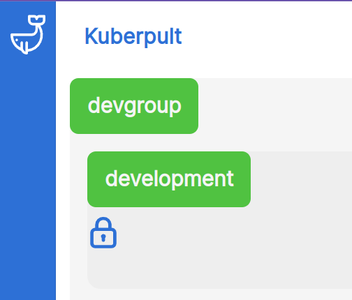
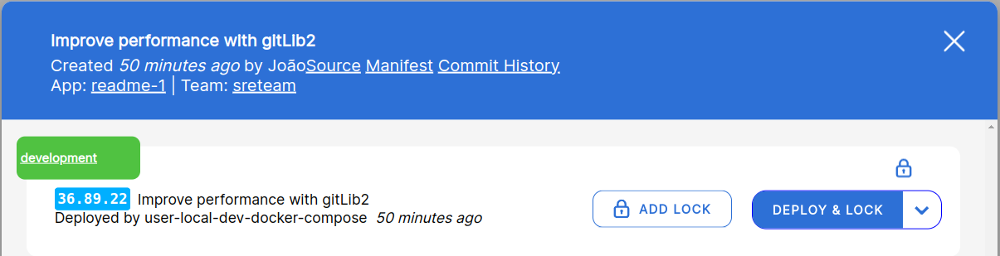

# Locks

## Concept
Kuberpult provides the concept of `Locks` to prevent automated deployments from deploying.
No automated process in kuberpult will deploy anything that has a lock on it.

## Environment Locks
An environment lock stops the deployment of **all** services of **one** environment.
Environment locks are useful when there is nobody working actively on the services for a while, like during Christmas.

## App Locks
An App Lock (or Service Lock) locks **one** service in **one** environment.
App Locks are useful to prevent a single deployment.

## Create Environment Lock
1) Go to the environments page `/ui/environments`.
2) Select `Add Environment in <env>`.
3) Give the lock a good description, e.g. 
    > Locked because of bug #Ref123 "buy button disabled"
4) Submit planned actions.

## See & Delete Environment locks
1) Go to the environments page `/ui/environments`.
2) You should see the lock icon like here next to the environment, e.g. `development`: 
3) Click on the lock icon to delete it.
4) Submit planned actions.

## Create App Lock
1) In the overview page (`/`) select the app and click on a tile in the overview. It only matters here to select the right app, it does not matter which version of the app we click on.
2) Click `Add Lock`
3) Give the lock a good description, e.g.
   > Locked because of bug #Ref123 "buy button disabled"
4) Submit planned actions.

## See and Delete App Locks
1) In the overview page (`/`) select the app and click on a tile in the overview. It only matters here to select the right app, it does not matter which version of the app we click on.
2) You should see the lock icon like here next to the environment, e.g. `development`: 
3) Click on the lock icon to delete it.
4) Submit planned actions.

