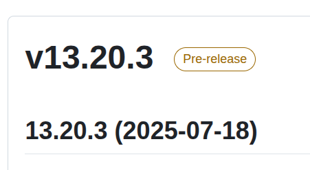
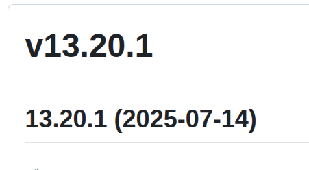

# GitHub Releases

Kuberpult uses [GitHub Releases](https://github.com/freiheit-com/kuberpult/releases).

## Pre-Releases

Most releases of kuberpult are "Pre-releases".

Pre-Release are **not** meant for production use.

You can recognize them by the "Pre-release" label:

## Full Releases

If a release is not marked as "Pre-release",
we call it a "full release".

You can recognize them by the *absence* of the "Pre-release" label:

While there are no guarantees (see license),
full Releases are the only ones **recommended** for production use,
because we do extra manual testing.
