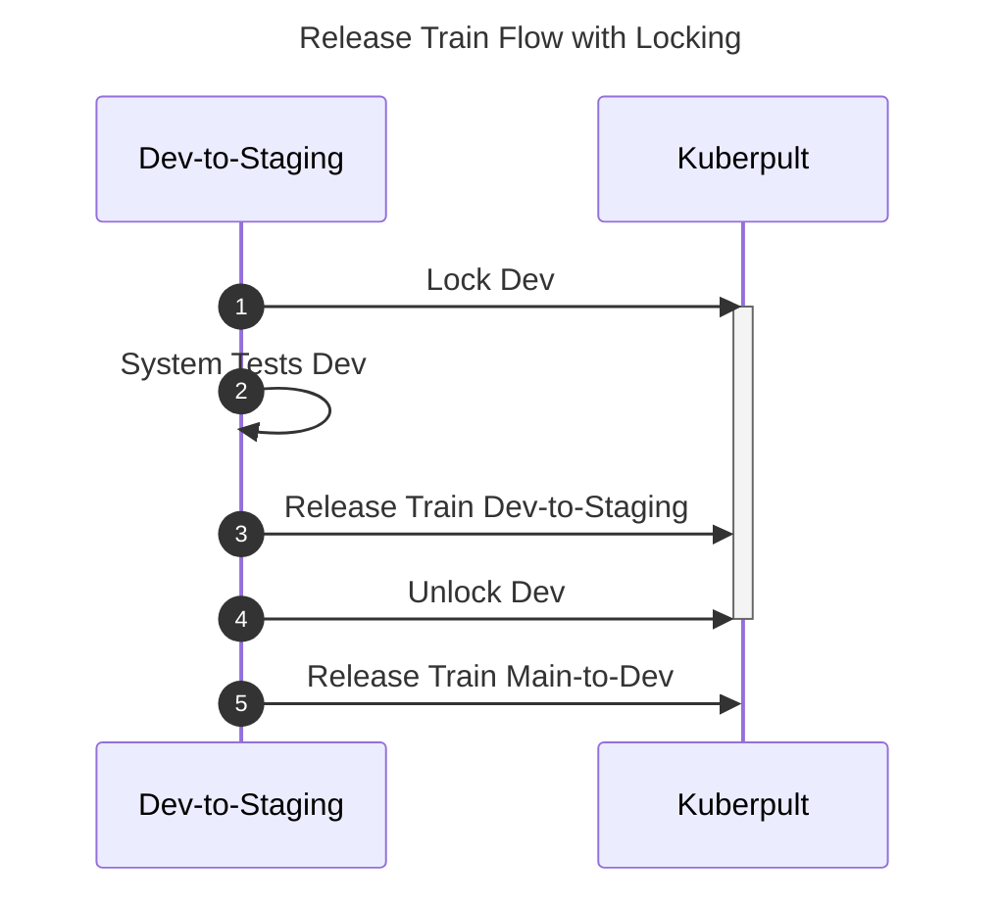

# Release Train Recommendations

Let's assume we have 2 stages: `Dev` and `Staging`, and `Dev` is the first stage (with `upstream: latest: true`).

Usually we want to run some test on `Dev`, before running a release train from `Dev` to `Staging`.

1) Running the system tests takes time, so the first step is to lock the environment `Dev`.
   Now we are sure that no automated process deploys different versions on `Dev`, and manual processes (humans) get a warning before deploying to `Dev`.
2) Now run the system tests on `Dev`.
3) If the tests are successful, we run the release train `Dev` to `Staging`.
4) Now we unlock `Dev` (independent of the test result).
5) We had `Dev` locked for a while, so there may be new changes that were stopped by the lock. To catch up `Dev` to the latest changes,
   we run a release train from `main` (this refers to the git branch) to `Dev`.
   This also needs to be done independent of the test result.

The same principle can be used multiple times, e.g. first `Dev` -> `Staging`, then `Staging` -> `Production`.

For illustration purposes we used **Environments** here as examples, but the same also works for **Environment Groups**.

