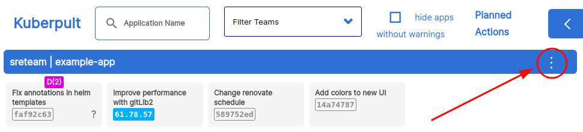
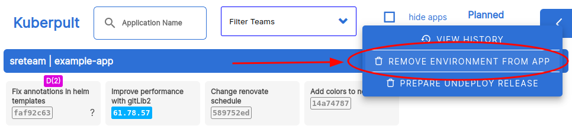
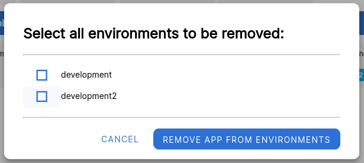
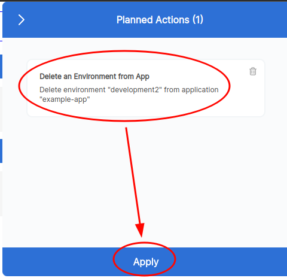

## Remove a service from environments

To remove a service from some (but not all) environments, the process is:

#### In your repository:

- Remove the `<enviornment>` (in the example below `development` or `development2`) kuberpult overlay from the service so that it does not get deployed anymore.
- Merge the overlay removal(s), triggering a [new release](./endpoint-release.md).

#### In Kuberpult:

- Remove environments from app (for each app/environment):
    
  
- Select environment(s) to remove. Note that you *cannot* remove all environments here, one has to stay. If you want to remove a service entirely, see [Remove a service entirely](./remove-service.md) below.
  
- Finally: Apply the change  
  
