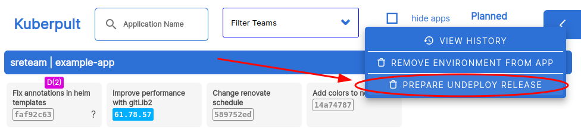
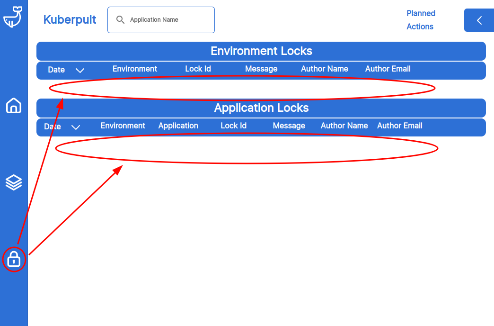
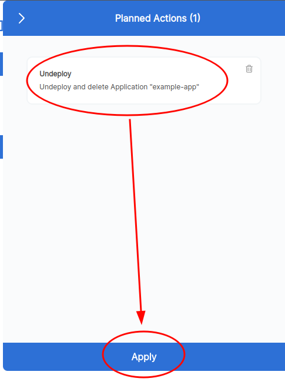

## Remove a service entirely

To remove a service _altogether_, proceed as follows:

#### In your repository:

- Remove the service completely (including all overlays)
- Merge the removal, triggering a new release

#### In Kuberpult:

- Hit "prepare to undeploy"  
  
- Be sure to remove all locks specific to this service & hit apply  
  
- Hit "Apply" & confirm  
  
- This creates an empty manifest that can be deployed like any other version.  
  
- Then, alternatively:
  - Either wait for the normal release trains to roll this out on all environments
  - Or deploy the "undeploy version" to all environments manually
- Hit "Delete Forever"
  - If that button doesn't exist, it means the "undeploy" version is not rolled out everywhere, or there is a lock.  
    
- Finally, hit "Apply"
  - Note that ArgoCd may need some time to apply this change.  
    
