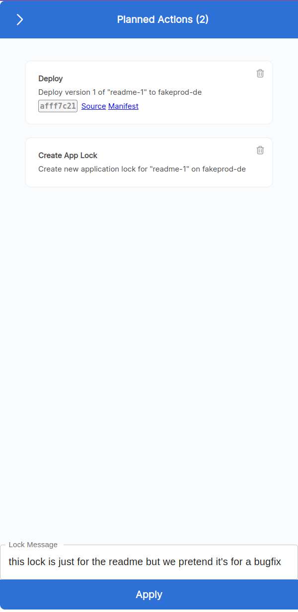

# How to roll back a microservice version

## Concept
You can easily roll back to an older version of a single service

## Rolling back
1) Identify the service and the version you want to deploy.
2) On the homepage, click on the tile representing the service and version you want to roll back.
3) Let's assume it's the tile `Release trains for env groups`:  
4) Select the environment where you want to deploy, as an example we pick `fakeprod-de`. We click `Deploy & Lock`.

5) Now you have 2 planned actions, that you still need to apply. 

