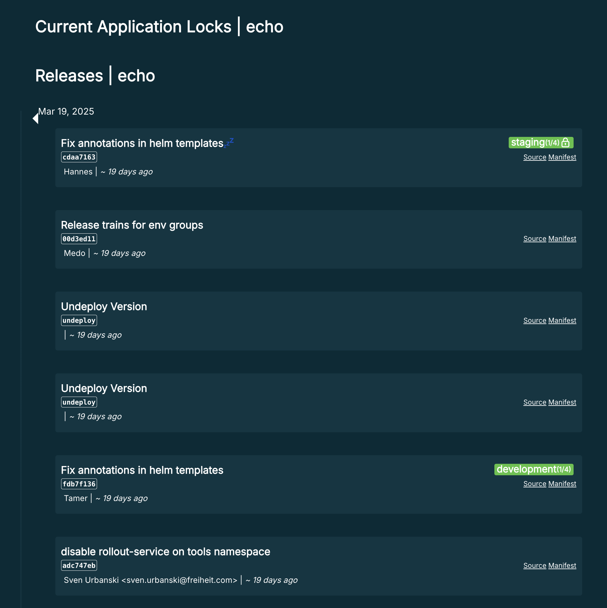
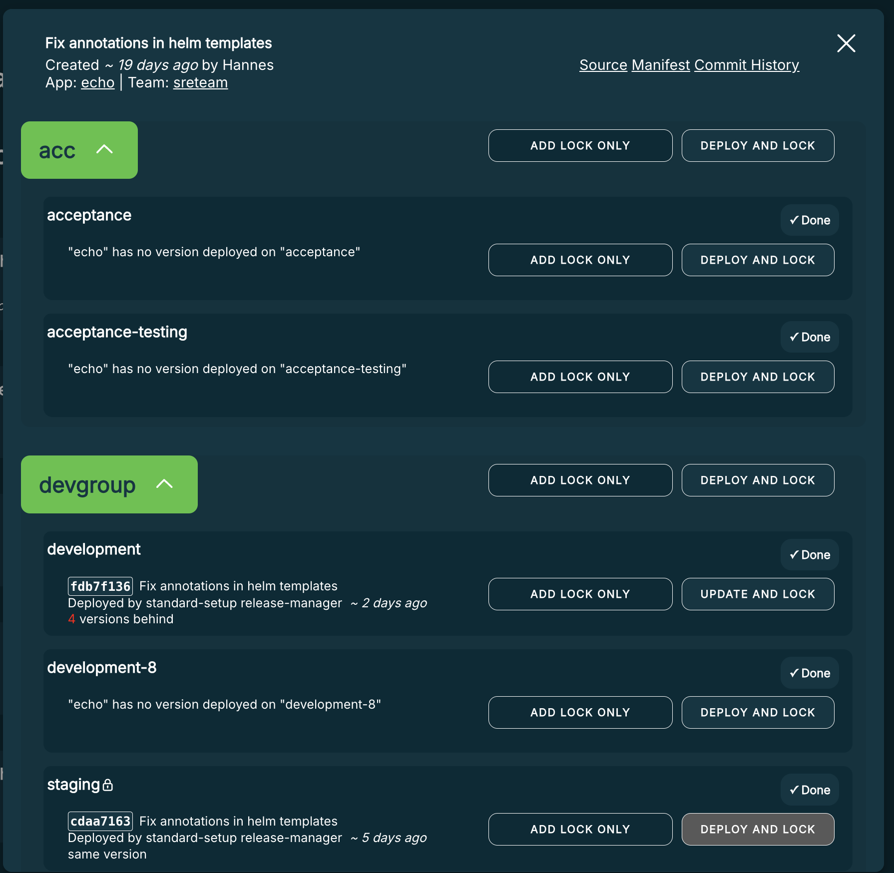

# Apps

## Concept

An "App" is essentially a microservice.
* A Kuberpult App contains the microservice **on all environments**.
* An Argo CD App contains the microservice **on one environment**.

Given `n` apps in kuberpult, and `m` environments, there will be `n*m` apps in Argo CD.

The practical limit for number of Argo CD Apps is a few thousand.

## Alternative Names
* Service
* Microservice

# Release
Each version of a Kuberpult App is called a release. A release contains manifests for all environments(kubernetes clusters) for that version.
In the Home page of Kuberpult all of the applications are listed. By clicking the `View History` button for each app, you can see all of the releases of that app throughout the time.

# Deployment
You can deploy any release to any environment in Kuberpult. Deploying a release to an environment means applying the manifests of that release and that environment to the corresponding kubernetes cluster.
By clicking on each release tile in Kuberpult UI, you can see the release dialog for each release. There, you can deploy the releases to environments/environment groups. You can also see the links to the release manifests and also (if the rollout-service is [enabled](https://github.com/freiheit-com/kuberpult/blob/37c21a21c180b070da3cd4c26b0063cd5c4acab8/charts/kuberpult/values.yaml#L230)) link to Argo CD apps.

