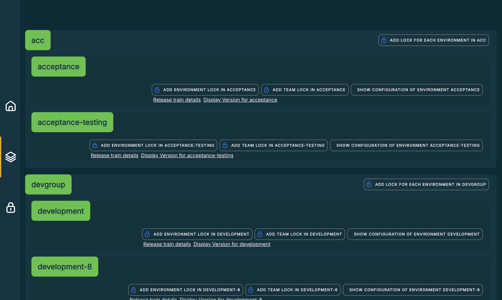

# Environment

An environment is a Kuberpult concept that describes the target of deployments.
Essentially, it is a set of machines where your microservices will run.
In practice, an environment in kuberpult corresponds 1:1 to a kubernetes cluster (for example on GCP).
An `environment` is the set of machines where your microservices will run.

For example: `development`, `staging` and `production` are typical environments.
When using environment groups, typical examples are `de-prod`, `jp-prod`, and `pt-prod` which would all be `production` environments - and belong to the `production` environment group - but are machines in different countries.

## UI
The Kuberpult UI has a page dedicated for the environments ( <kuberpult-url>/ui/environments ). There, you can see the list of environment groups and environments. By clicking on `Show configuration of Environment <env-name>` you can see the configuration file of each environment.


## Environment Config

In a cloud provider like GCP, we recommend separating the environments on a project level. This means that one GCP project correlates to one Kuberpult environment 1:1 - although this is not a technical requirement.

Environments are also called `stages` - but in Kuberpult we stick to `environments`, in short `envs`.

The config for an environment is stored in a json file called `config.json`. This file belongs in the environment's directory like this: `environments/development/config.json` (in this example the `config.json` file would dictate the configuration for the `development` environment).

In the `config.json` file there are 3 main fields:
- [Upstream](#upstream)  `"upstream"`
- [Argo CD](#argocd)    `"argocd"`
- [EnvironmentGroup](#environment-group) `"environmentGroup"`

### Upstream:

The `"upstream"` field can have one of the two options (cannot have both):
  - `latest`: can only be set to `true` which means that Kuberpult will deploy the latest version of an application to this environment
  - `environment`: has a string which is the name of another environment. Following the chain of upstream environments would take you to the one with `"latest": true`. This is used in release trains: when a release train is run in an environment, it will pull the version from the environment's upstream environment.

### Argo CD: 

The `"argocd"` field has a few subfields:
- `"accessList"`:  
  Is a list of objects that describe which resources are allowed in the cluster ([Argo CD Docs](https://argo-cd.readthedocs.io/en/stable/operator-manual/declarative-setup/#projects)).
  Note that this is only necessary when Argo CD cannot apply a certain resource on the cluster. Most common resources (Pods, Configmaps, Cronjobs, Deployments...) just work out of the box.
  It has the following fields:
  - `"group"`: relates to the Kubernetes API group without the version
  - `"kind"`: the resource type in kubernetes

- `"destination"` (**Mandatory**):
  > Defines which Kubernetes cluster/namespace to deploy to
  >
  > \- [Template Argo CD Docs](https://argo-cd.readthedocs.io/en/stable/operator-manual/applicationset/Template/#template-fields)

  It has the following fields:
  - `"name"` (**Mandatory**): Name of the cluster (within Argo CD) to deploy to
  - `"server"` (**Mandatory**): API Server URL for the cluster (Example: `"https://kubernetes.default.svc"`)
  - `"namespace"`: Target namespace in which to deploy the manifests from source (Example: `"my-app-namespace"`)

    > Usually you want to use the same namespace for Applications and AppProjects. For this, use the field `"namespace"`.
    > 
    > We also allow to use different namespaces for Applications and AppProjects. In that case **don't** use namespace, use `appProjectNamespace` and `applicationNamespace` instead.

  - `"appProjectNamespace"`: defines the namespaces allowed to deploy in the project. Example:
      ```yaml
        # Do not allow any app to be installed in `kube-system`  
          - namespace: '!kube-system'
      ```
  - `"applicationNamespace"`: This sets the default namespace to deploy a resource in the application if no namespace is defined on the resource's manifests. Example:
      ```yaml
        # Destination cluster and namespace to deploy the application
        destination:
          server: https://kubernetes.default.svc
          # The namespace will only be set for namespace-scoped resources that have not set a value for .metadata.namespace
          namespace: guestbook
      ```

- `"syncWindows"`:
  > Sync windows are configurable windows of time where syncs will either be blocked or allowed. Note that this is not generally necessary, and by default, Argo CD syncs all the time. We recommend to only use this setting, if it's really necessary, as it complicates the deployment pipeline.
  >
  > - [Sync Windows Argo CD Docs](https://argo-cd.readthedocs.io/en/stable/user-guide/sync_windows/)

  It has the following fields:
  - `"schedule"`: is the schedule of the window in `cron` format (Example: `"10 1 * * *"`)
  - `"duration"`: the duration of the window (Example: `"1h"`)
  - `"kind"`: defines whether the sync is allowed (`"allow"`) or denied (`"deny"`)
  - `"applications"`: an array with the names of the applications

- `"ignoreDifferences"`:
  > Argo CD allows ignoring differences at a specific JSON path, using RFC6902 JSON patches and JQ path expressions.
  > 
  > [Application Level Config Argo CD Docs](https://argo-cd.readthedocs.io/en/stable/user-guide/diffing/#application-level-configuration)

  It has the following fields:
  - `"group"`: relates to the Kubernetes API group without the version
  - `"kind"`: the resource type in kubernetes
  - `"name"`: application name
  - `"namespace"`: namespace in the cluster
  - `"jsonPointers"`: is a list of strings that is used to configure which fields should be ignored when comparing differences (Example: `- /spec/replicas` would ignore differences in `spec.replicas` which is useful when we don't want to sync fields that change overtime but don't need a sync)
  - `"jqPathExpressions"`: is a list of strings that can be used to ignore elements of a list by identifying list items based of item content (Example: `- .spec.template.spec.initContainers[] | select(.name == "injected-init-container")`) ([JQ Docs](https://stedolan.github.io/jq/manual/#path(path_expression)))
  - `"managedFieldsManagers"`: is a list of string which can be used to ignore fields owned by specific managers defined in your live resources (Example: `- kube-controller-manager`)

- `"applicationAnnotations"`: Map of annotations to add to the resources

- `"syncOptions"`: A list of strings that allows users to customize some aspects of how it syncs the desired state in the target cluster ([Sync Options Argo CD Docs](https://argo-cd.readthedocs.io/en/stable/user-guide/sync-options/))

### Environment Group:

The `"environmentGroup"` field is a string that defines which environment group the environment belongs to (Example: `Production` can be an environment group to group production environments in different countries).
The goal of EnvironmentGroups is to make handling of many similar clusters easier. They will also work with Release Trains.
