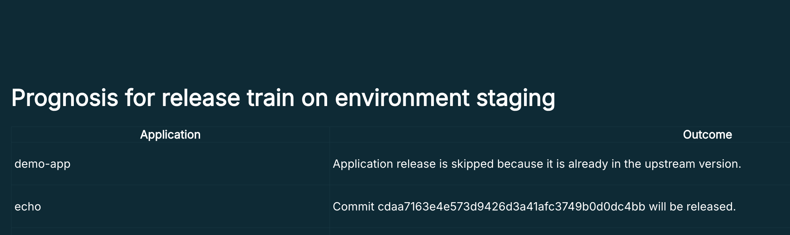

# Release Train

## Concept

A release train is a concept that ensures that we deploy *often* and *regularly*.
The idea is that the train does not wait for you - it will leave (deploy) on time, regardless of how many services/commits are ready.

The train should run *often enough* to not slow down development, while also giving the testers enough time to look at changes before they go live.

## What happens under the hood

A release train takes the versions that are currently deployed on one environment and deploys those version to another environment.

So there are 2 environments involved:
* *target*:  this is where the services will be deployed (where the version changes happen), *target* can be either a single `environment` or an `environmentGroup`. in the case of `environmentGroup` the train will run for all environments belonging to this `environmentGroup`. If one environment cannot be changed (e.g. because of a lock), the other environments will still be processed.
* *upstream*: This is the source for the *versions* of the apps. You should run system tests on this environment before running the release train.
  See environment documentation on configuration.
* *targetType*: specifies whether the `target` is a `environment` or an `environmentGroup` or its `unknown`

  
## Triggering a Release Train

The release train needs to be triggered externally - there is nothing inside `Kuberpult` that triggers it.
The trigger is usually implemented as a GitHub Action, Google Cloud Build, etc.

## Release Train Recommendations

Let's assume we have 2 stages: `Dev` and `Staging`, and `Dev` is the first stage (with `upstream: latest: true`).

Usually we want to run some test on `Dev`, before running a release train from `Dev` to `Staging`.


```
    Kuberpult: Lock Dev
    System Tests Dev
    Release Train Dev-to-Staging
    Unlock Dev
    Release Train Main-to-Dev
```

1) Running the system tests takes time, so the first step is to lock the environment `Dev`.
   Now we are sure that no automated process deploys different versions on `Dev`, and manual processes (humans) get a warning before deploying to `Dev`.
2) Now run the system tests on `Dev`.
3) If the tests are successful, we run the release train `Dev` to `Staging`.
4) Now we unlock `Dev` (independent of the test result).
5) We had `Dev` locked for a while, so there may be new changes that were stopped by the lock. To catch up `Dev` to the latest changes,
   we run a release train from `main` (this refers to the git branch) to `Dev`.
   This also needs to be done independent of the test result.

The same principle can be used multiple times, e.g. first `Dev` -> `Staging`, then `Staging` -> `Production`.

For illustration purposes we used **Environments** here as examples, but the same also works for **Environment Groups**.


## Prognosis


It is possible to get the prognosis, or plan, of a release train without triggering one. A release train prognosis does not alter the manifest repo in any way.

In the Kuberpult UI, in the environments page, you can see a `Release train details` button in front of each environment. By clicking it you can see prognosis page of release train on that environment. There, you can see what will happen if you run a release train on that environment.


### Skip causes
A release train may skip an application or an environment because of different reasons, which are available in the prognosis page. Here, we will list all of the skip causes:

#### Application Skip Causes
* **APP_ALREADY_IN_UPSTREAM_VERSION:** Application release is skipped because it is already in the upstream version.
* **APP_DOES_NOT_EXIST_IN_ENV:** Application release is skipped because it does not exist in the environment.
* **APP_HAS_NO_VERSION_IN_UPSTREAM_ENV:** Application release is skipped because it does not have a version in the upstream environment.
* **APP_IS_LOCKED:** Application release is skipped because it is locked.
* **APP_IS_LOCKED_BY_ENV:** Application release is skipped because there's an environment lock where this application is getting deployed.
* **TEAM_IS_LOCKED:** Application release is skipped due to a team lock
* **NO_TEAM_PERMISSION:** Application release is skipped because the user is not on the team of the application
* **UNRECOGNIZED:** Application release it skipped due to an unrecognized reason

#### Environment Skip Causes
* **ENV_IS_LOCKED**: Release train on this environment is skipped because it is locked.
* **ENV_HAS_BOTH_UPSTREAM_LATEST_AND_UPSTREAM_ENV:** Release train on this environment is skipped because it both has an upstream environment and is set as latest.
* **ENV_HAS_NO_UPSTREAM:** Release train on this environment is skipped because it has no upstream configured.
* **ENV_HAS_NO_UPSTREAM_LATEST_OR_UPSTREAM_ENV:** Release train on this environment is skipped because it neither has an upstream environment configured nor is marked as latest.
* **UPSTREAM_ENV_CONFIG_NOT_FOUND:** Release train on this environment is skipped because no configuration was found for it.
* **UNRECOGNIZED:** Release train on this environment is skipped due to an unknown reason.
