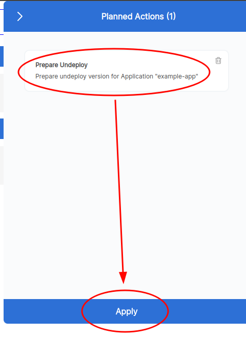
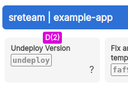
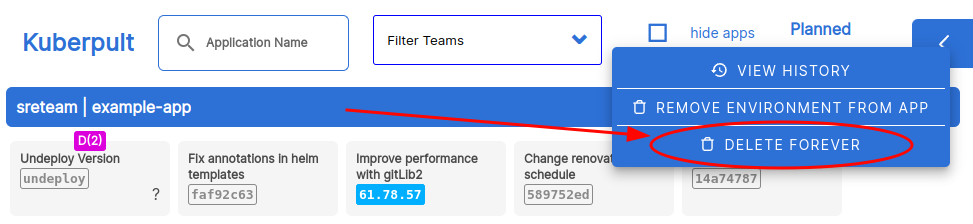

# Delete app forever

For deleting an application completely from kuberpult, it introduces a new concept called **Undeploy Release**. This release, is basically a release with empty manifest for all of the environments. You can create an undeploy release in the kuberpult UI using `Prepare Undeloy Release` button for each app.
If you want to delete an application completely from kuberpult, first, you should prepare an undeploy release and deploy that release on all of the environments. Then the `Delete App Forever` button will appear, with which you can completely delete the application from kuberpult.

## Steps
* Make sure that you first remove the app from your mono-repo and merge that change.
* Hit "prepare to undeploy"

* Be sure to remove all locks specific to this service & hit apply

* Hit "Apply" & confirm

* This creates an empty manifest that can be deployed like any other version.

* Then, alternatively:
   * Either wait for the normal release trains to roll this out on all environments
   * Or deploy the "undeploy version" to all environments manually
* Hit "Delete Forever"
    * If that button doesn't exist, it means the "undeploy" version is not rolled out everywhere, or "undeploy" is not the latest version, or there is a lock.

* Finally, hit "Apply"
    * Note that ArgoCd may need some time to apply this change.

# Remove Environment From app
Another option that you have in Kuberpult is removing an environment completely from an app. You can do this by clicking `Remove Environment from App` for an app and then choosing the environments that you want to remove. This will remove the chosen environments from all of the releases manifests.

## Steps
* Remove environments from app (for each app/environment):

* Select environment(s) to remove. Note that you cannot remove all environments here, one has to stay.

* Finally: Apply the change
