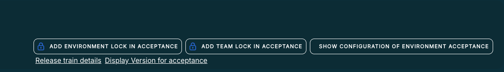
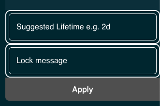
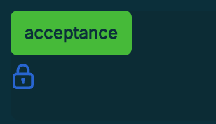
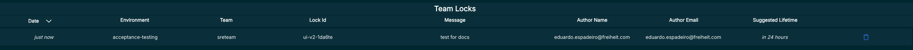
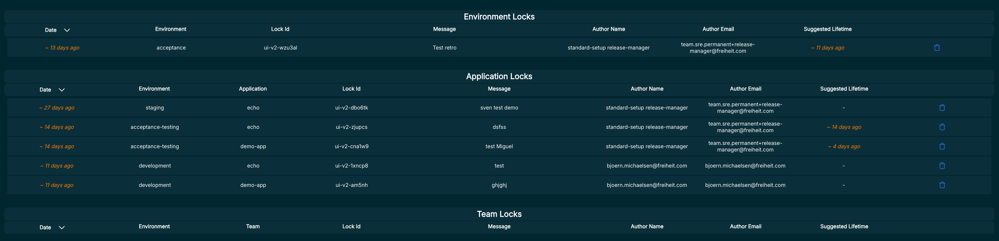

# Locks
## Concept
Kuberpult provides the concept of `Locks` to prevent automated deployments from deploying.
No automated process in kuberpult will deploy anything that has a lock on it.

## Environment Locks
An environment lock stops the deployment of **all** services of **one** environment.
Environment locks are useful when there is nobody working actively on the services for a while, like during Christmas.

## App Locks
An app lock (or service lock) stops the deployment of **one** service in **one** environment.
App Locks are useful to prevent a single deployment.

## Team Locks
A team lock stops the deployment of **all* services that belong to **one** team of **one** environment.
These work the same as environment locks, but are specific to one team alone.

## Create Environment Lock
1) Go to the environments page `/ui/environments`.
2) Select `Add Environment Lock in <env>`.
 
3) Give the lock a good description, e.g.
 
    > Locked because of bug #Ref123 "buy button disabled"
4) Submit planned actions.

## See & Delete Environment locks
1) Go to the environments page `/ui/environments`.
2) You should see the lock icon like here next to the environment, e.g. `development`: 
 
3) Click on the lock icon to delete it.
4) Submit planned actions.

## Create App Lock
1) In the overview page (`/`) select the app and click on a tile in the overview. It only matters here to select the right app, it does not matter which version of the app we click on.
2) Click `Add Lock`
3) Give the lock a good description, e.g.
   > Locked because of bug #Ref123 "buy button disabled"
4) Submit planned actions.

## See and Delete App Locks
1) In the overview page (`/`) select the app and click on a tile in the overview. It only matters here to select the right app, it does not matter which version of the app we click on.
2) You should see the lock icon like here next to the environment, e.g. `development`: 
3) Click on the lock icon to delete it.
4) Submit planned actions.

## Create Team Lock
1) Go to the environments page `/ui/environments`.
2) Select `Add Team Lock in <env>`.
 
3) Give the lock a good description, e.g.
 
    > Locked because of bug #Ref123 "buy button disabled"
4) Submit planned actions.

## See & Delete Team locks
1) Go to the locks page `/ui/locks`.
2) You should see the lock in the team locks table: 
  
3) Click on the trash icon to delete it.
4) Submit planned actions.

## Suggested Lifetime
Each lock has a field called 'Suggested Lifetime'. After this time, it won't be deleted automatically, but others may consider removing it.
This lifetime is shown in the locks table. This field is mandatory when creating the lock using UI, but it's not mandatory when we're creating it using API.

## Locks Page
In `/ui/locks`, you can find the locks page where you have a table for each kind of lock (environment, application and team locks), which shows when they were created, their suggested lifetime, message, their environment, the lock's id and the lock's author. It also shows the application in case of application locks and team in case of team locks.
 

Each lock also shows a trash icon which when pressed will add an action for deleting that lock.