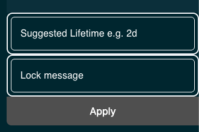
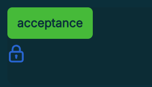
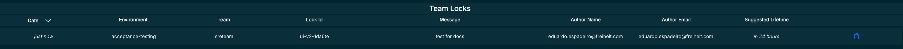
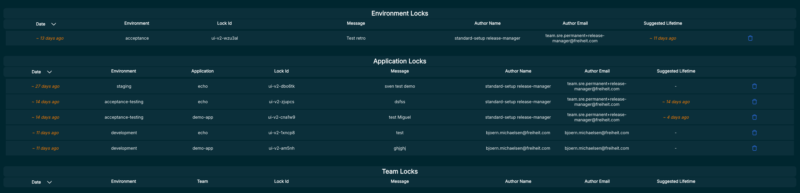

# Locks
## Concept
Kuberpult provides the concept of `Locks` to prevent automated deployments from deploying.
No automated process in kuberpult will deploy anything that has a lock on it.

## Environment Locks
An environment lock stops the deployment of **all** services of **one** environment.
Environment locks are useful when there is nobody working actively on the services for a while, like during Christmas.

## App Locks
An app lock (or service lock) stops the deployment of **one** service in **one** environment.
App Locks are useful to prevent a single deployment.

## Team Locks
A team lock stops the deployment of **all* services that belong to **one** team of **one** environment.
These work the same as environment locks, but are specific to one team alone.

## Create Environment Lock
1) Go to the environments page `/ui/environments`.
2) Select `Add Environment Lock in <env>`.
 
3) Give the lock a good description, e.g.

    > Locked because of bug #Ref123 "buy button disabled"
4) Submit planned actions.

## See & Delete Environment locks
1) Go to the environments page `/ui/environments`.
2) You should see the lock icon like here next to the environment, e.g. `development`: 
 
3) Click on the lock icon to delete it.
4) Submit planned actions.

## Create App Lock
1) In the overview page (`/`) select the app and click on a tile in the overview. It only matters here to select the right app, it does not matter which version of the app we click on.
2) Click `Add Lock`
3) Give the lock a good description, e.g.
   > Locked because of bug #Ref123 "buy button disabled"
4) Submit planned actions.

## See and Delete App Locks
1) In the overview page (`/`) select the app and click on a tile in the overview. It only matters here to select the right app, it does not matter which version of the app we click on.
2) You should see the lock icon like here next to the environment, e.g. `development`: 
3) Click on the lock icon to delete it.
4) Submit planned actions.

## Create Team Lock
1) Go to the environments page `/ui/environments`.
2) Select `Add Team Lock in <env>`.
 
3) Give the lock a good description, e.g.
 
    > Locked because of bug #Ref123 "buy button disabled"
4) Submit planned actions.

## See & Delete Team locks
1) Go to the locks page `/ui/locks`.
2) You should see the lock in the team locks table: 
  
3) Click on the trash icon to delete it.
4) Submit planned actions.

## Manifest Locks

Imagine you are responding to an emergency situation, and you needed to make a manual change in your manifest-repo.
Kuberpult would normally overwrite this change at the next deployment.
This deployment can happen delayed if kuberpult is receiving a lot of requests (new releases, release trains, etc.),
because the manifest-repo-export-service processes them all sequentially.

To prevent kuberpult from overwriting a manifest, kuberpult has **manifest locks**.

A manifest lock prevents Kuberpult from writing manifest files to git for **one service** in **one environment**.
Since ArgoCD watches the git repository, this stops ArgoCD from applying any new version of that service to the environment.

Note that manifest locks only have an effect when using the manifest-repo-export with the helm option `manifestRepoExport.enabled: true`.

### Near-instant locking

Normal locks (environment, app, team) work at the *deployment* level inside Kuberpult:
- When a deployment is triggered while a lock is active, Kuberpult's cd-service stops the deployment instead of executing it.
- The manifest-repo-export service processes events from a queue and writes the results to git.
  Because of this queue, there can be a noticeable delay between the moment a normal lock is created and the moment it actually stops new manifests from reaching ArgoCD.
  The manifest-repo-export service only processes events that are already in the Database - it does not check for normal locks.

Manifest locks work at the *git-write* level:
- Just before writing files to git, the manifest-repo-export service checks whether a manifest lock exists.
- If one does, the write operation is skipped immediately — no manifest change is pushed to ArgoCD.

Use a manifest lock when you need the lock to take effect immediately - like in an emergency situation -
without waiting for the manifest-export queue to drain.
Normal locks are sufficient when a short delay is acceptable.

### How long is this delay?

This varies heavily depending on the load.
If you have DataDog metrics enabled, you can observe the queue size and processing duration with the 2 metrics
`Kuberpult.process_delay_seconds` (number of seconds behind) and `Kuberpult.process_delay_events` (number of events behind).

### What manifest locks do not affect

A manifest lock only controls whether files are written to git. It does **not** change what Kuberpult considers "currently deployed":
- The overview page and deployment history still reflect the version Kuberpult last recorded as deployed.
- Once the manifest lock is removed, the next deployment event will write the correct manifest to git and ArgoCD will catch up.

### Create a Manifest Lock
1. In the overview page (`/`), click `...` (more options) on the service lane for the service you want to lock.
2. Select `Add Manifest Lock`.
3. Select one or more environments.
4. Give the lock a description and submit.

Only one manifest lock can exist per service/environment combination at a time. The create button is disabled if a lock is already active.

### See & Delete Manifest Locks
Go to the locks page `/ui/locks`. Manifest locks appear in the manifest locks table with a trash icon to delete them.
When you delete a manifest-lock, kuberpult will ask if you want to re-deploy this service. To ensure that your manifest repository
is correct, it's recommended to re-deploy. If you manually reverted your change in the manifest-repo, you can skip re-deployment.

## Suggested Lifetime
Each lock has a field called 'Suggested Lifetime'. After this time, it won't be deleted automatically, but others may consider removing it.
This lifetime is shown in the locks table. This field is mandatory when creating the lock using UI, but it's not mandatory when we're creating it using API.

## Locks Page
In `/ui/locks`, you can find the locks page where you have a table for each kind of lock (environment, application and team locks), which shows when they were created, their suggested lifetime, message, their environment, the lock's id and the lock's author. It also shows the application in case of application locks and team in case of team locks.
 

Each lock also shows a trash icon which when pressed will add an action for deleting that lock.