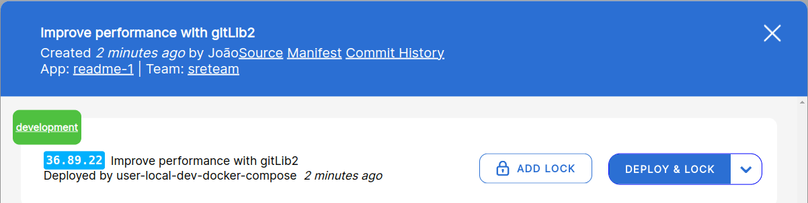
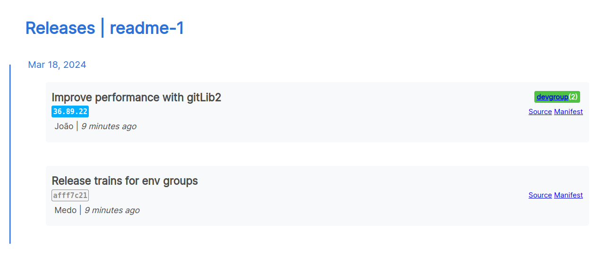

# Status
When you use kuberpult, one of these cases is true:
* Kuberpult pushes the manifests to a git repository, that is then used by argocd, using micro service called `manifest-repo-export-service`. It can be enabled in [the helm charts](https://github.com/freiheit-com/kuberpult/blob/1d4192f5814c4a824bd8409ec89267f53eff1d8c/charts/kuberpult/values.yaml#L186)
* Kuberpult communicates directly with argocd. This job is done using a microservice called `rollout-service`. It can be enabled in [the helm charts](https://github.com/freiheit-com/kuberpult/blob/1d4192f5814c4a824bd8409ec89267f53eff1d8c/charts/kuberpult/values.yaml#L186)

If the `rollout-service` is not enabled, kuberpult reports the status of the updates to the git repository(`Git Sync Status`). Otherwise, it reports the status of the updates to argocd(`Rollout status`).

## Git sync status
There are four cases for an applications's git sync status:
* **Synced:** All the latest updates in the kuberpult are applied to the git repo.
* **Unsynced:** The latest changes for this app are not yet applied to the git repository.
* **Error:** There was an issue during applying the changes to the git repository. You can see all failed events in the failed Esl Events page. Refer to troubleshooting document (work in progress) for more information.
* **Unknown:** The status of the updates is unknown to kuberpult, probably because of some issue with connecting to git.

## Rollout status
These are the cases for an application's update to argocd status. This only shows up if the `rollout-service` is enabled:
* **Successful:** All the latest updates in the kuberpult are applied to argocd.
* **Progressing:** Argocd picked up the change from kuberpult but didn't apply it yet.
* **Pending:**  Argocd hasn't yet picked up the change from kuberpult yet.
* **Unhealthy:** Argocd applied the change succesfully, but the app is unhealthy.
* **Error:** Argocd applied the change but failed.
* **Unknown:** Argocd didn't report anything for this app.

## What is deployed currently?
Kuberpult defines the *should* state (what should be deployed),
while Argo CD handles the *current* state (what is deployed).
There are several ways to lookup the current version in kuberpult:

### Release Dialog
Under the green section "development", you can see which version is currently deployed on `development`:

### Overview

On the overview (home page), you can see:
* which version of this service is deployed on `2` environments in the `D` (`dev`) environment-group.
* this service is not deployed anywhere else, because there's no other indicators apart from `D(2)`.

### History
On the history page, you can see the same information as on the overview:

