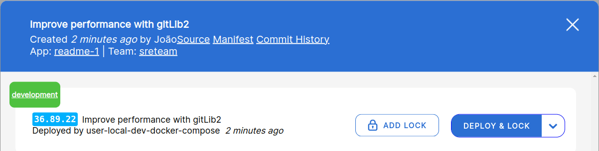
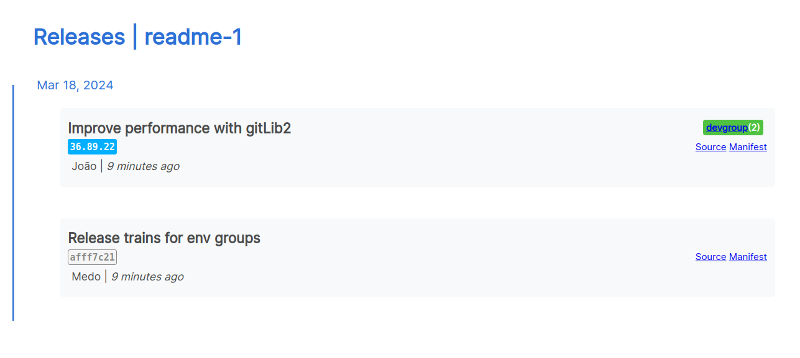

# What is deployed currently?

## Concept

Kuberpult defines the *should* state (what should be deployed),
while Argo CD handles the *current* state (what is deployed).

## Looking up the current version in kuberpult

### Release Dialog
Under the green section "development", you can see which version is currently deployed on `development`:
  

### Overview

On the overview (home page), you can already see that:
* this service is deployed on `2` environments in the `D` (`dev`) environment-group.
* this service is not deployed anywhere else, because there's no other indicators apart from `D(2)`.

### History
On the history page, you can see the same information as on the overview:

