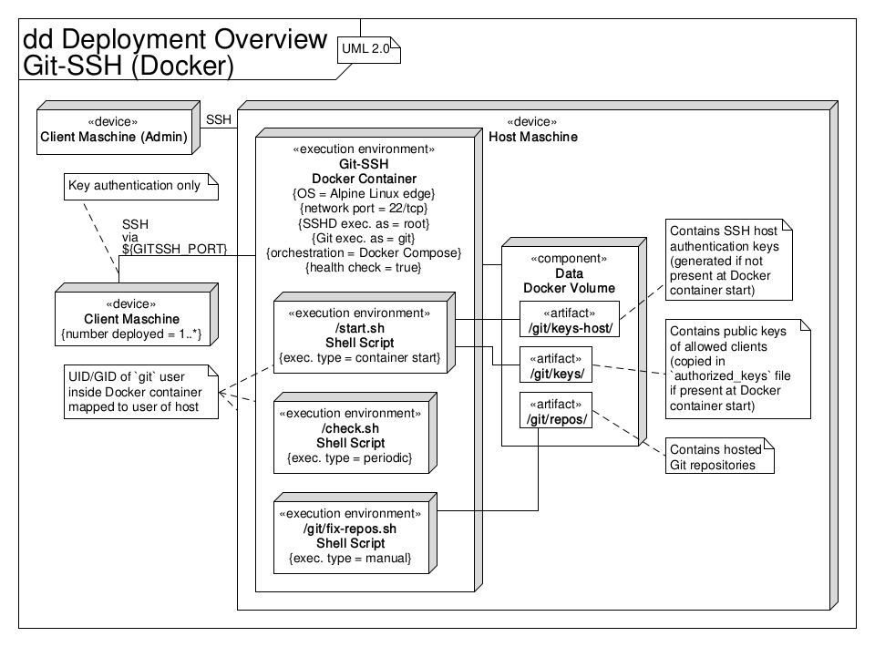

# Git-SSH (Docker)

A simple Git-over-SSH server Docker image with UID/GID handling, based on
Alpine Linux.

*The [Quickstart section](#quickstart) shows the fastest way to set everything
up without providing further details.*

Clients (users) can interact with the server using Git after adding their
public SSH key to the Git-SSH server for authentication.
Within the Docker container all Git repositries are managed by a single `git`
user, whos UID/GID is specified at container start.
Normal (interactive shell) SSH access to the Docker host machine that runs the
container is needed to add a new user/client (add an SSH public key) and create
or delete Git reposities.  
The UML deployment diagram in the figure below gives an overview.


 
> Used terminology in this documentation:
> * Client - Client machine that connects to the host
> * Host - Host machine that runs the Docker container

> Used variables in this documentation:
> * `GITSSH_BASE_PATH` - Path to the directory that contains this project’s
>   files (especially `Dockerfile` + other build-related files and
>   `docker-compose.yml`)
> * `GITSSH_GID` - GID assigned to the `git` user within the Docker container,
>   e.g. `1000`.
>   The access permissions of the Docker volumes content will be set to this
>   GID.
> * `GITSSH_UID` - UID assigned to the `git` user within the Docker container,
>   e.g. `1000`.
>   The acces spermissions of the Docker volumes content will be set to this
>   UID.
> * `GITSSH_PORT` - Network port used for the Git SSH connection, e.g. `2222`
> * `REPO_NAME` - Name of the Git repository
> * `SERVER` - Network address (IP/domain name) of the host
> * `USER` - SSH user used to login to the host
> * `VERSION` - Version of this project, e.g. `1.0.0`.
>   Adheres to [Semantic Versioning](https://semver.org).

## Quickstart

**How to** set everything up the fastest way possible:

Step 1 (on the host):

```sh
$ cd ${GITSSH_BASE_PATH}
$ make build
$ make prepare-deploy
```

... and adjust `docker-compose.yml`.

Step 2 (on the client):

```sh
$ ssh-keygen -t ed25519
$ scp ~/.ssh/id_ed25519.pub ${USER}@${SERVER}:${GITSSH_BASE_PATH}/git-ssh/keys/
```

Step 3 (on the host):

```sh
$ make deploy
```

## Applicability

The main use case for this project is to provide a very simple but secure^1
solution to host Git repositories on a network (e.g., LAN/WAN/internet), using
SSH key authentication.

^1: "Secure" here only means access restiction and encryption using SSH key
authentication.

## Requirements

For basic usage (mandatory):
* Docker

For easy handling (recommended):
* Docker Compose
* Make

## Makefile

Most of the instructions in this documentation can also be run with the
provided `Makefile` (which uses Docker Compose).
Run `cd ${GITSSH_BASE_PATH} && make help` to see the list of available targets.

> The Makefile uses Docker Compose, see the prerequisite in "How to run the
> container with Docker Compose (on the host)" in the [Run section](#run).

## Build

**How to** build the Docker image (on the host):

```sh
$ cd ${GITSSH_BASE_PATH}
$ sudo docker build -t git-ssh:${VERSION} .
$ sudo docker image tag git-ssh:${VERSION} git-ssh:latest
```

## Arguments

* Exposed port: `22`
* Volumes:
    * `/git/keys-host`: Volume to store the SSHD host keys
    * `/git/keys`: Volume to store the users’ public keys
    * `/git/repos`: Volume to store the Git repositories
* Environment variables:
    * `PUID`: UID that is assigned to the `git` user inside the Docker container
    * `PGID`: GID that is assigned to the `git` user inside the Docker container

## Run

**How to** run the Docker container (on the host):

```sh
$ cd ${GITSSH_BASE_PATH}
$ mkdir -p ./git-ssh/keys-host/ ./git-ssh/keys/ ./git-ssh/repos/
$ sudo docker run \
  -d \
  -p ${GITSSH_PORT}:22 \
  -v ${GITSSH_BASE_PATH}/git-ssh/keys-host/:/git/keys-host/ \
  -v ${GITSSH_BASE_PATH}/git-ssh/keys/:/git/keys/ \
  -v ${GITSSH_BASE_PATH}/git-ssh/repos/:/git/repos/ \
  -e PUID=${GITSSH_UID} \
  -e PGID=${GITSSH_GID} \
  --name="git-ssh" \
  git-ssh:latest
```

**How to** run the container with Docker Compose (on the host):

Prerequisite:
Copy `docker-compose.yml.template` to `docker-compose.yml` and adjust it.

> Instead of modifying `docker-compose.yml` after copying it, one can create an
> `.env` file that provides the necessary variables:
>
> ```sh
> GITSSH_PORT=
> GITSSH_BASE_PATH=
> GITSSH_UID=
> GITSSH_GID=
> ```

```sh
$ cd ${GITSSH_BASE_PATH}
$ mkdir -p ./git-ssh/keys-host/ ./git-ssh/keys/ ./git-ssh/repos/
$ sudo docker-compose up -d
```

## SSH keys

> Based on [this reference](https://www.ssh.com/ssh/keygen/).

**How to** generate an SSH private/public key pair (on the client):

> This generates stronger keys than the default, RSA.

```sh
$ ssh-keygen -t ecdsa -b 521
```

> Or if supported by the client:
> `ssh-keygen -t ed25519`

**How to** add a client’s SSH public key to the Git-SSH server:

Upload the key to the host’s volume mount point (on the client):

```sh
$ scp ~/.ssh/id_ecdsa.pub ${USER}@${SERVER}:${GITSSH_BASE_PATH}/git-ssh/keys/
```

Restart the Docker container (on the host):

```sh
$ sudo docker restart git-ssh
```

> Or with Docker Compose:
> `sudo docker-compose down -t 1 && sudo docker-compose up -d`

## Basic usage

**How to**
* check that the Docker container works and
* list all repositories
(on the client):

> The client’s SSH public key must have been uploaded to the host already.

```sh
$ ssh -p ${GITSSH_PORT} git@${SERVER}

~~~ Welcome to Git-SSH server! ~~~
[...]
You have successfully authenticated but
interactive shell access is not provided.
[...]
```

**How to** create a new (bare) repository (on the host):

```sh
$ sudo docker exec -u git git-ssh git init --bare ./repos/${REPO_NAME}.git
```

> Or with Docker Compose:
> `sudo docker-compose exec -u git git-ssh git init --bare ./repos/${REPO_NAME}.git`

**How to** clone a repository (on the client):

```sh
$ git clone ssh://git@${SERVER}:${GITSSH_PORT}/git/repos/${REPO_NAME}.git
```

**How to** push a (non-bare) repository that (yet) only exists locally (on the
client):

Prerequisite: Create a new (bare) repository (on the host).

> See "How to create a new (bare) repository (on the host)".

```sh
$ git remote add origin \
  ssh://git@${SERVER}:${GITSSH_PORT}/git/repos/${REPO_NAME}.git
$ git push -u origin master
```

> Replace `git remote add [...]` with `git remote set-url [...]` if `origin`
> already exists.

> Repeat the `git push [...]` command for all tracking branches ...

**How to** upload an existing bare repository (on the client):

```sh
$ scp -r /path/to/${REPO_NAME}.git \
  ${USER}@${SERVER}:${GITSSH_BASE_PATH}/git-ssh/repos/
```

> Make sure that uploaded bare repositories have the correct access permissions
> set (see "How to fix Git repository access permission issues (on the host)"
> in the [Troubleshooting section](#troubleschooting)).

## Troubleshooting

**How to** fix Git repository access permission issues (on the host):

```sh
$ sudo docker exec git-ssh sh ./fix-repos.sh
```

> Or with Docker Compose:
> `sudo docker-compose exec git-ssh sh ./fix-repos.sh`
